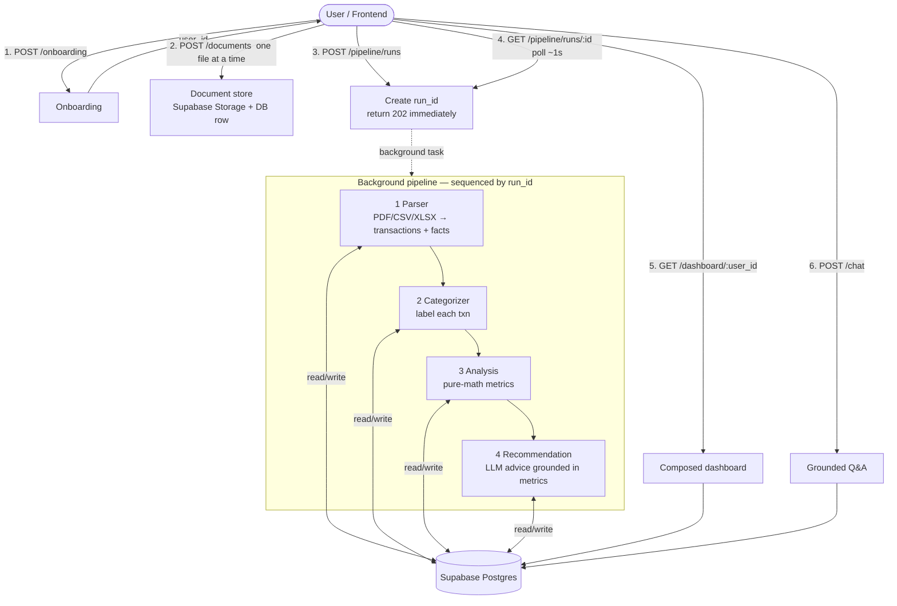
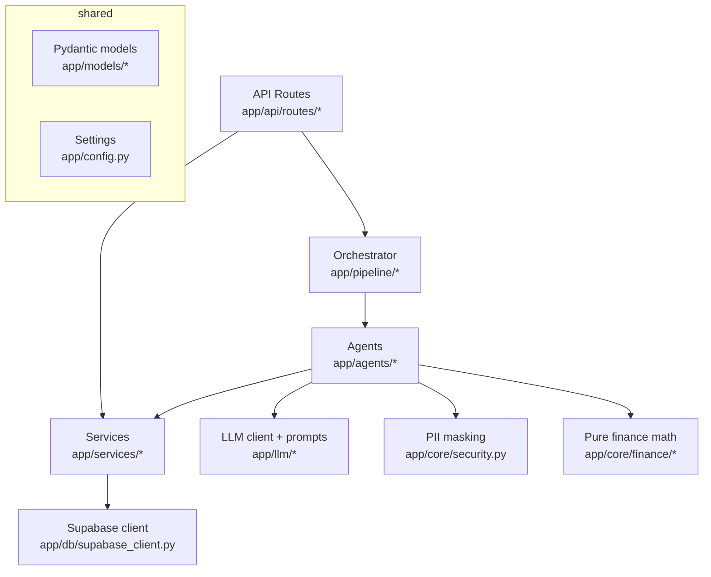
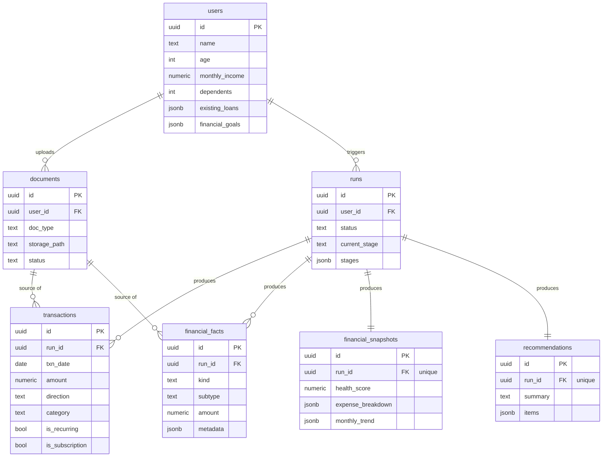
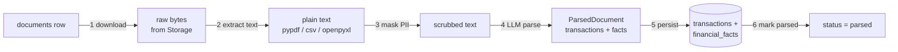
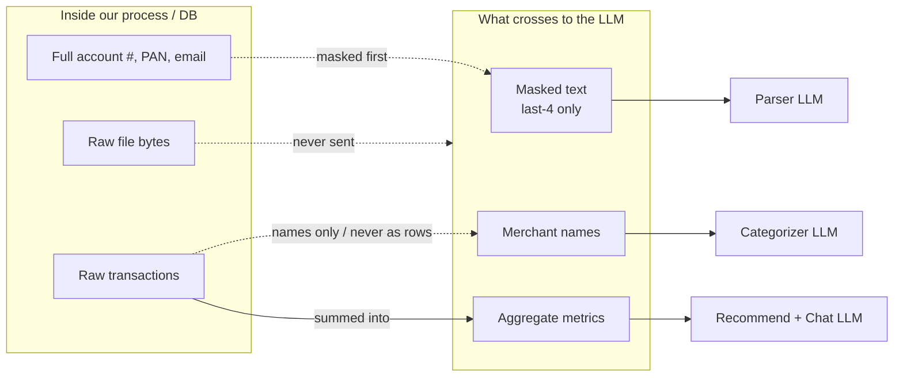

# Personal Finance Copilot — End-to-End Architecture

_A single, detailed walkthrough of how the whole system works: what the user
does, what the backend does at each step, how each PDF is turned into structured
data, and — the part people always ask about — **exactly what data is sent to the
LLM, how much of it, and why.**_

> **Provider note (read this first):** the LLM provider in the running code is
> **Groq**, not Gemini. The client wrapper (`app/llm/client.py`) is written to be
> provider-agnostic (its docstring mentions Groq/Claude/Gemini as swappable), but
> every actual call today goes to **Groq-hosted open models** (Llama 3.x,
> `openai/gpt-oss-120b`). Wherever this doc says "the LLM," the wire call is to
> Groq. Swapping to Gemini would mean changing only `client.py` + the model names
> in `config.py`; nothing else in the pipeline changes.

---

## Table of contents

1. [The 10,000-ft view](#1-the-10000-ft-view)
2. [Tech stack & why](#2-tech-stack--why)
3. [The layered architecture](#3-the-layered-architecture)
4. [The data model (what's stored where)](#4-the-data-model-whats-stored-where)
5. [The full request lifecycle](#5-the-full-request-lifecycle)
6. [Deep dive: how a PDF becomes structured data (Agent 1)](#6-deep-dive-how-a-pdf-becomes-structured-data-agent-1)
7. [What exactly is sent to the LLM (the money question)](#7-what-exactly-is-sent-to-the-llm-the-money-question)
8. [Agent 2 — Categorizer](#8-agent-2--categorizer)
9. [Agent 3 — Financial Analysis (pure math)](#9-agent-3--financial-analysis-pure-math)
10. [Agent 4 — Recommendation](#10-agent-4--recommendation)
11. [The dashboard & chat endpoints](#11-the-dashboard--chat-endpoints)
12. [Security & the PII boundary](#12-security--the-pii-boundary)
13. [Concurrency, background execution & failure handling](#13-concurrency-background-execution--failure-handling)
14. [Deployment & ops](#14-deployment--ops)
15. [Known limitations](#15-known-limitations)

---

## 1. The 10,000-ft view

The product is a **Personal Finance Copilot**. A user onboards with a few basics,
uploads their financial documents (bank statement, salary slip, credit-card
statement, loan statement, investment statement), and the backend runs everything
through a **linear multi-agent pipeline** that produces a financial profile: a
health score, spending insights, and grounded recommendations. They can then
**chat** with an assistant about their own money.

The pipeline is four agents, run **strictly in order**:

```
parse  →  categorize  →  analyze  →  recommend
```

The single most important architectural rule:

> **Agents never call each other. Each agent reads its input from the database
> (keyed by `run_id`), does its work, and writes its output back to the
> database.** The orchestrator just sequences them.

This is what makes the system simple to reason about, re-runnable without
duplication, and independently testable stage-by-stage.



---

## 2. Tech stack & why

| Concern | Choice | Why |
|---|---|---|
| Web framework | **FastAPI** | Async, typed, auto Swagger docs, built-in `BackgroundTasks`. |
| Database | **Supabase Postgres** | Managed Postgres; accessed directly via `supabase-py` (no ORM). |
| File storage | **Supabase Storage** (private `documents` bucket) | Raw uploaded files live here; the DB only stores a `storage_path` pointer. |
| Validation / schemas | **Pydantic v2** | Every request, DB row, and LLM output is a typed model. |
| LLM provider | **Groq** | Free-tier-friendly TPM/TPD limits and fast inference on open models. |
| Structured LLM output | **`instructor`** | Forces the LLM to return JSON matching a Pydantic model, with automatic retry on schema mismatch. |
| PDF / CSV / Excel text | **`pypdf`, `csv`, `openpyxl`** | Local text extraction — no cloud OCR service involved. |
| Config | **`pydantic-settings`** (`.env`) | One typed `Settings` object; unknown keys ignored. |
| Deploy | **Render** (`render.yaml` Blueprint) | Free web service; self-ping keep-alive so it doesn't sleep. |

**Auth:** none in the MVP. Onboarding returns a `user_id` that the frontend
stores in `localStorage` and passes on later requests. The backend uses the
Supabase **secret (service-role)** key, so it bypasses row-level security and must
only ever run server-side.

**Currency:** everything is INR (₹).

---

## 3. The layered architecture

The codebase is a clean onion — each layer only knows about the one beneath it.



| Layer | Location | Responsibility | Rule |
|---|---|---|---|
| **Routes** | `app/api/routes/` | HTTP in/out only. Thin. | No business logic, no DB calls of their own beyond calling services. |
| **Services** | `app/services/` | **All** Supabase reads/writes. One module per concern. | The *only* place that touches the DB/Storage. |
| **Orchestrator** | `app/pipeline/` | Sequences the 4 agents, tracks run/stage status. | Linear sequencer, not a graph engine. |
| **Agents** | `app/agents/` | The 4 pipeline stages. | Read input by `run_id`, write output back. Never call each other. |
| **Core / finance** | `app/core/finance/` | Pure metric math. | No DB, no LLM, no I/O — fully deterministic & unit-testable. |
| **Core / security** | `app/core/security.py` | PII masking before any LLM call. | Runs on extracted text *before* it reaches a prompt. |
| **LLM** | `app/llm/` | Groq client + per-agent prompt builders. | One place to swap provider/model. |
| **Models** | `app/models/` | Pydantic schemas: requests, responses, DB rows, LLM contracts. | Single source of truth for shapes. |
| **DB** | `app/db/supabase_client.py` | Cached Supabase client factory. | Built once with the secret key. |

---

## 4. The data model (what's stored where)

Seven tables (`db/schema.sql`), plus one private Storage bucket. The pivotal
concept is **`run_id`**: transactions, facts, snapshots, and recommendations are
all scoped to the run that produced them, so re-running the pipeline never
duplicates or mixes data — each run owns an independent dataset.



The two shapes the parser produces are worth internalizing, because everything
downstream depends on the distinction:

- **`transactions`** — *ledger line-items*. Something happened on a date: a coffee
  purchase, a salary credit, an EMI debit. Has `txn_date`, `amount`, `direction`
  (credit/debit), `merchant`.
- **`financial_facts`** — *point-in-time figures*. A single number that describes
  a position: "₹25L loan outstanding," "net salary ₹97,500," "mutual fund value
  ₹3.4L." Has `kind` (income/expense/asset/liability), `subtype`, `amount`,
  `metadata`.

A loan's outstanding balance is not a "transaction" — it's a fact. Keeping them in
separate tables is why the analysis stage can cleanly build a balance sheet
(assets/liabilities from facts) *and* a cash-flow picture (from transactions).

---

## 5. The full request lifecycle

Here's the entire happy path as the frontend drives it.

```mermaid
sequenceDiagram
    participant FE as Frontend
    participant API as FastAPI
    participant BG as Background task
    participant DB as Supabase (DB+Storage)
    participant LLM as Groq

    FE->>API: POST /onboarding {name, age, income, ...}
    API->>DB: insert users row
    API-->>FE: 201 {user_id}

    loop once per file
        FE->>API: POST /documents (multipart: user_id, doc_type, file)
        API->>DB: upload file to Storage + insert documents row (status=uploaded)
        API-->>FE: 201 {document}
    end

    FE->>API: POST /pipeline/runs {user_id}
    API->>DB: insert runs row (all stages pending)
    API->>BG: schedule run_pipeline(run_id)
    API-->>FE: 202 {run_id, pending}

    Note over BG,LLM: runs after the HTTP response is sent
    BG->>DB: run status = running
    BG->>DB: read documents; download each file
    BG->>LLM: parse each doc (masked text)  ← Agent 1
    LLM-->>BG: structured transactions + facts
    BG->>DB: write transactions + facts (run_id)
    BG->>DB: read txns; categorize          ← Agent 2
    BG->>LLM: (only unknown merchants, batched)
    BG->>DB: update txn categories/flags
    BG->>DB: read txns+facts; compute_metrics ← Agent 3 (no LLM)
    BG->>DB: write financial_snapshot
    BG->>LLM: metrics + profile → advice     ← Agent 4
    BG->>DB: write recommendations
    BG->>DB: run status = done

    loop poll ~1s until done/failed
        FE->>API: GET /pipeline/runs/{run_id}
        API-->>FE: {status, current_stage, stages[]}
    end

    FE->>API: GET /dashboard/{user_id}
    API->>DB: latest snapshot + facts + recs + subs
    API-->>FE: DashboardResponse

    FE->>API: POST /chat {user_id, messages[]}
    API->>DB: latest snapshot
    API->>LLM: system(snapshot) + history
    LLM-->>API: reply
    API-->>FE: {role, content}
```

**Key timing facts**

- `POST /pipeline/runs` returns **`202 Accepted` immediately** with an all-pending
  run. The real work runs in a FastAPI **`BackgroundTasks`** function
  (`run_pipeline`) after the response is sent, so the client is never blocked.
- Because FastAPI runs synchronous background functions in a threadpool, the
  blocking LLM/HTTP calls inside the agents don't freeze the server's event loop.
- The frontend **polls** `GET /pipeline/runs/{run_id}` (~1s) and renders the
  `stages` array as the "watch the agents work" progress board. It stops polling
  when `status` is `done` or `failed`.
- The poll endpoint returns **status only** — never result data. Results come from
  `/dashboard`.

---

## 6. Deep dive: how a PDF becomes structured data (Agent 1)

This is the heart of the question "how is each PDF parsed?" The parser
(`app/agents/parser_agent.py`) is the **only** place we read raw documents and the
first place we call the LLM.

It loops over **every** document the user uploaded for this run and processes each
one independently through six steps:



### Step 1 — Download
`document_service.download_document(storage_path)` pulls the raw file bytes back
from the private Supabase Storage bucket. The DB never stored the file itself,
only the path.

### Step 2 — Extract text (local, no cloud)
`_extract_text` dispatches on file extension:

| Extension | Library | How |
|---|---|---|
| `.pdf` | **`pypdf`** | `PdfReader(...)`, then `page.extract_text()` joined across all pages with newlines. |
| `.csv` | **`csv`** | Each row's non-empty cells joined with `" \| "`. |
| `.xls/.xlsx` | **`openpyxl`** | Every sheet, every row's non-empty cells joined with `" \| "`. |
| `.png/.jpg/...` | — | **Rejected**: raises "image OCR is not enabled yet." That doc is marked `failed`, others continue. |

> **Important:** PDF parsing here is **text extraction, not OCR**. `pypdf` reads
> the text layer embedded in the PDF. A scanned/image-only PDF yields little or no
> text and will fail the `"no extractable text found"` check. This is why the
> dummy statements are digitally-generated PDFs with a real text layer.

If extraction yields empty text, the document errors out (isolated — see failure
handling below).

### Step 3 — Mask PII (before any LLM call)
`core.security.scrub_text` runs on the extracted text **before** it's ever placed
in a prompt. It masks:

```
A/C 123456789012          →  A/C XXXXXXXX9012      (last 4 kept)
card 4532 1122 3344 5566  →  card XXXXXXXXXXXX5566  (last 4 kept)
PAN ABCDE1234F            →  [PAN]
me@example.com            →  [EMAIL]
paid 12,500.00            →  paid 12,500.00         (amounts untouched)
```

Last-4 is kept so the model can still associate a row with an account; **amounts
are deliberately preserved** so extraction stays accurate. See §12 for the full
boundary discussion.

### Step 4 — LLM parse (the one call per document)
`_llm_parse` sends the masked text to Groq and gets back a validated
`ParsedDocument`. The details of *what* is sent are in §7 — this is the step that
answers "how much goes to the LLM."

The prompt is **per-document-type** (`app/llm/prompts/parser.py`): a bank
statement is told to fill `transactions`; a salary slip is told to produce
`facts`, not transactions; etc. (table below). The call uses **JSON mode** via
`instructor` (not tool-calling) because Groq's strict tool-call schema validation
rejects the small quirks small models emit (`null` vs `[]`, string vs date). JSON
mode + `instructor`'s lenient Pydantic validation + retry is far more robust.

### Step 5 — Persist
`_persist` maps the LLM's `ExtractedTransaction` / `ExtractedFact` objects into
`TransactionCreate` / `FinancialFactCreate` rows — adding `run_id`, `user_id`,
`document_id`, and a `metadata` tag with the doc type — then bulk-inserts them via
the transaction/fact services. **`category` and the recurring flags are left
null** — that's Agent 2's job.

### Step 6 — Mark parsed
The document's status flips to `parsed`.

### Per-document-type behavior

| Document type | Produces | Example output |
|---|---|---|
| `bank_statement` | `transactions` (+ optional savings-balance fact) | credit/debit line items |
| `credit_card_statement` | `transactions` + `cc_outstanding` fact | purchases, payments, amount due |
| `salary_slip` | `facts` only (income) | `salary` net pay, `gross_salary`; deductions in `meta` |
| `loan_statement` | `facts` (liability) + optional EMI transactions | outstanding principal, `meta.emi`, `meta.interest_rate` |
| `investment_statement` | `facts` only (asset) | one fact per holding: `mutual_fund` / `fd` / stock value |

### The LLM output contract (`app/models/parser.py`)
`ParsedDocument` = `summary?`, `warnings[]`, `transactions[]`, `facts[]`. Every
field has a **lenient `before` validator** that normalizes junk rather than
failing (null→`[]`, unparseable date→`None`, negative amount→`abs`), because small
models are loose with strict schemas and `instructor`'s retry loop is the backstop.

---

## 7. What exactly is sent to the LLM (the money question)

This is the section to point people at when they ask "what data is moving, and how
much?"

### 7.1 Every LLM call in the system

There are exactly **four kinds** of LLM calls. Two of the four stages call the LLM
per-something; the analysis stage never does.

| # | Where | Model (default) | Frequency | What's sent | Roughly how big |
|---|---|---|---|---|---|
| 1 | **Parser** | `llama-3.3-70b-versatile` | **once per document** | System prompt + per-type guidance + the **entire masked document text** | Largest call. A full statement's text — hundreds to a few thousand tokens. |
| 2 | **Categorizer** (fallback) | `llama-3.1-8b-instant` | **at most once per run** | System prompt + a **deduped list of unknown merchant name strings** | Tiny. Just a bulleted list of names — no amounts, no dates. |
| 3 | **Recommendation** | `openai/gpt-oss-120b` | **once per run** | System prompt + the **computed metrics snapshot + profile** | Small & fixed. ~30 aggregate numbers, no raw transactions. |
| 4 | **Chat** | `openai/gpt-oss-120b` | **once per user message** | System prompt (metrics snapshot) + last 20 messages of history | Small & bounded. Snapshot + short chat history. |

> Model names above are the defaults in `app/config.py`, which `render.yaml`
> declares as the single source of truth. They've been changed a few times as Groq
> deprecated/rate-limited models (see git history) — always check `config.py` for
> the live values. Output is capped by `GROQ_MAX_TOKENS` (currently **4000**).

### 7.2 The parser call — the biggest data movement

For each document the payload is:

```
messages = [
  { role: "system", content: PARSER_SYSTEM },        # ~2 sentences, fixed
  { role: "user",   content: guidance + "\n\nDocument text:\n\n" + SAFE_TEXT }
]
temperature = 0        # deterministic extraction
max_tokens  = 4000     # output cap (GROQ_MAX_TOKENS)
response_model = ParsedDocument   # instructor forces JSON matching this
```

- **What moves:** the *entire masked text* of one document. For a 3-month bank
  statement that's every ledger line (date, description, amount, balance) as plain
  text — but with account numbers, cards, PAN, and emails already masked.
- **What does NOT move:** the raw PDF/file bytes (only extracted text is sent),
  full account numbers, PAN, or email addresses.
- **How much:** proportional to the statement size. A typical dummy statement is a
  few hundred to a couple thousand tokens of input; the output JSON (the extracted
  rows) is capped at 4000 tokens. Very large statements can approach that cap —
  see limitations (§15): page-chunking isn't implemented yet.
- **One document = one call.** Five uploaded documents = five parser calls, each
  independent. There is no cross-document call.

### 7.3 The categorizer call — deliberately tiny

Most transactions are categorized for **zero tokens** by a keyword rules table
(§8). Only *unknown debit* merchants reach the LLM, and they're **deduped** (five
Swiggy orders → one entry) and sent in **one batched call**:

```
user content =
  "Allowed categories: Food, Rent, ...\n\n
   Assign each of these merchants/descriptions to exactly one category:\n
   - UPI-PQR ENTERPRISES\n
   - SOME UNKNOWN VENDOR\n
   ..."
```

No amounts, no dates, no account context — **just merchant name strings**. This is
the smallest LLM footprint in the system, and it may not fire at all if the rules
cover everything.

### 7.4 The recommendation & chat calls — aggregates only, never raw

Both are grounded in the **computed snapshot** — roughly 30 aggregate numbers
(income, expenses, ratios, health score, top categories, subscription totals,
assets, liabilities). **Raw transactions are never sent.** The prompt explicitly
forbids inventing numbers and instructs the model to cite the real figures. So
even the "reasoning" LLM calls only ever see summary statistics, not line-items —
another PII reduction, and the reason the advice can't hallucinate figures.

### 7.5 One picture of the data-minimization funnel

```
Raw PDF bytes  ──(never sent)──►
   extracted text  ──(masked)──►  SAFE TEXT ──► [Parser LLM]         ← the only raw-ish detail
      transactions ──(names only, deduped)──►  merchant list ──► [Categorizer LLM]
         computed metrics ──(aggregates only)──►  snapshot ──► [Recommend LLM] & [Chat LLM]
```

Every step downstream sends **less and more abstracted** data to the model.

---

## 8. Agent 2 — Categorizer

`app/agents/categorizer_agent.py`. Reads the run's transactions and fills the
three fields the parser left blank: `category`, `is_recurring`, `is_subscription`.
Facts are untouched (they already carry `kind`/`subtype`).

**Hybrid strategy — rules first, LLM only for the long tail:**

```
for each transaction:
    rules pass (keyword → category, WORD-BOUNDARY match)   ← free, deterministic
    credit + salary keyword → Income
    other credit           → Transfer
    unknown debit          → collect for the LLM
if any unknown debits:
    ONE batched LLM call (deduped names) → category each
    LLM error? → default to Other        ← never fails the run
```

- **Rules** (`_RULES`) are an ordered keyword→category list, first match wins.
  Investment/EMI are checked before generic Shopping so a `GROWW…SIP` outflow is
  `Investment` (savings), not misread as Income. Matching is on **word boundaries**
  (`\bjio\b`) so `AJIO` (Shopping) doesn't collide with `jio` (Utilities).
- **Why hybrid:** a handful of big Indian merchants (Swiggy, Netflix, Amazon,
  rent, EMI…) cover most transactions with identical results every run — which
  matters for a finance app where category totals shouldn't wobble between runs.
- **Recurring/subscription detection is pure heuristics, no LLM:** group by
  normalized merchant; `is_recurring` if it spans 2+ months, appears 3+ times, or
  is a subscription; `is_subscription` if it matches a subscription keyword list
  (Netflix, Spotify, gym, Adobe…). Every subscription is recurring; not vice-versa
  (rent recurs but isn't a subscription).
- **Persistence** is a grouped bulk update: rows sharing the same
  `(category, is_recurring, is_subscription)` are updated in one
  `UPDATE ... WHERE id IN (...)` instead of one call per transaction.

Two deliberate taxonomy choices: **Subscriptions is a flag, not a category**
(Netflix is *Entertainment* that happens to auto-charge); **Investment is its own
category** and is treated as savings, not spend, by Agent 3.

---

## 9. Agent 3 — Financial Analysis (pure math)

`app/agents/analysis_agent.py` is a **thin wrapper**; all arithmetic lives in
`app/core/finance/calculations.py` as **pure functions — no DB, no LLM, no I/O.**
This is deliberate: finance metrics must be **correct, reproducible, auditable,
and testable**. LLMs approximate arithmetic; `sum()` doesn't.

```
transactions(run_id) + facts(run_id) + user.declared_income
   └─ compute_metrics()  (pure)
        ├─ normalise everything to MONTHLY over the observed period
        ├─ reconcile income, classify each category
        ├─ savings rate · debt-to-income · runway · health score
        └─ dashboard extras (essential/discretionary, subs, monthly trend)
   └─ save_snapshot(run_id)   (one row per run, upsert on run_id)
```

**Money definitions (all normalized to monthly over the observed months):**

| Metric | Definition |
|---|---|
| `monthly_income` | net-salary **fact** → else Income-category credits ÷ months → else declared onboarding income (first available wins) |
| `monthly_expenses` | consumption-category debits ÷ months (Food, Rent, Utilities, Shopping, Travel, Entertainment, Health, Other) |
| `monthly_debt_payments` | EMI_Loan debits ÷ months (fallback: loan facts' `emi` metadata) |
| `monthly_investments` | Investment debits ÷ months — **counted as savings, not spend** |
| `net_cash_flow` | income − expenses − debt_payments |
| `savings_rate` | net_cash_flow / income |
| `debt_to_income` | debt_payments / income |
| `emergency_runway_months` | total_assets / (expenses + debt_payments) |

**Excluded from spend ratios:** Transfer, ATM cash, and credit-card *bill*
payments (money moving, not consumed — the card's actual purchases are already
captured from the credit-card statement, so counting the bill payment too would
double-count).

**Health score (0–100), transparent weights:**

```
savings_score : full marks at savings rate ≥ 20%, zero at ≤ 0%
debt_score    : full marks at DTI = 0%,  zero at DTI ≥ 40%
runway_score  : full marks at runway ≥ 6 months, zero at 0
health_score  = 0.40·savings_score + 0.30·debt_score + 0.30·runway_score
```

Sub-scores are stored too, so the recommendation agent and dashboard can explain
*why* the score is what it is. The result is written as one `financial_snapshots`
row (upsert on `run_id`).

---

## 10. Agent 4 — Recommendation

`app/agents/recommendation_agent.py`. Reads the snapshot (Agent 3's numbers) + the
user profile, and asks the LLM for a short summary plus 3–5 prioritized,
actionable recommendations.

```
client.chat.completions.create(
    model = RECOMMENDATION_GROQ_MODEL,      # openai/gpt-oss-120b
    response_model = RecommendationSet,     # instructor-validated
    temperature = 0.3,                      # a little creativity, still grounded
    max_tokens = 2048,
    messages = [system, grounded_metrics_prompt],
)
```

The prompt (`build_recommendation_prompt`) renders the exact figures — health
score + sub-scores, cash flow, ratios, top spend categories, subscriptions,
assets/liabilities — and instructs the model to **target the weakest areas
(lowest sub-scores), cite the real figure in each rationale, and give one concrete
action.** It only ever sees aggregates (no raw transactions → no PII), so it can
reason about the finances but never fabricate them. Each `Recommendation` has
`title`, `category`, `priority` (high/med/low), `rationale`, `action`. Saved as
one `recommendations` row (upsert on `run_id`).

---

## 11. The dashboard & chat endpoints

These are **read/serve** endpoints — they don't run the pipeline.

### `GET /dashboard/{user_id}` (`app/api/routes/dashboard.py`)
Composes one payload from the user's **latest** completed snapshot:

- Finds `financial_service.get_latest_snapshot(user_id)` (most recent by
  `created_at`), then that snapshot's `run_id`.
- Pulls facts, recommendations, and subscription transactions for that run.
- Splits facts into `assets` / `liabilities` by `kind`.
- Dedupes subscriptions by merchant (a monthly Netflix charge appears once).
- Returns `DashboardResponse`: profile + metrics snapshot + recommendation summary
  & list + asset/liability lists + subscriptions. (`persona` is reserved/`null`.)

### `POST /chat` (`app/api/routes/chat.py`)
**Stateless** grounded Q&A. The client holds the conversation and sends the full
history each turn; the server:

1. Loads the user's latest snapshot (404 if none — chat needs a finished analysis).
2. Builds a **system prompt that embeds the snapshot** (`build_chat_system`) — the
   same ~30 aggregate numbers, no raw transactions.
3. Forwards the **last 20** messages of history (bounds token cost).
4. Calls the chat model (`temperature=0.4`, `max_tokens=800`), returns the reply.

The assistant is instructed to answer only from the provided figures, cite a
number whenever it makes a claim, and — for "what-if" questions — estimate but
state its assumptions. (No streaming in the MVP; one reply per call.)

---

## 12. Security & the PII boundary



- **Masking happens before the first prompt**, in `core/security.py`
  (`scrub_text`): 16-digit cards and 9–18-digit account numbers → last-4 only; PAN
  → `[PAN]`; email → `[EMAIL]`. Amounts are preserved so extraction stays accurate.
- **The deeper you go in the pipeline, the less raw data reaches the model:** only
  the parser sees document-level detail (and it's masked); categorizer sees only
  names; recommendation and chat see only aggregates.
- **Service-role key is server-side only.** The backend uses Supabase's secret key
  (bypasses RLS). It must never reach the client. Storage bucket is private.
- **No auth in the MVP** — `user_id` is an unguessable UUID passed by the client;
  fine for a demo, not for production (anyone with a `user_id` can read that
  user's dashboard). JWT hooks (`SUPABASE_JWKS_URL`, publishable key) are stubbed
  in config for a future auth phase.

---

## 13. Concurrency, background execution & failure handling

- **Background execution:** `POST /pipeline/runs` schedules `run_pipeline(run_id)`
  via FastAPI `BackgroundTasks`. It runs after the response is sent, in a
  threadpool (so blocking LLM calls don't stall the event loop). The upload
  request and the background worker are different execution contexts — they share
  state **only through the DB** (the `runs` row), which is why status is persisted,
  not held in memory.
- **Status tracking:** `pipeline_service` updates the run's overall `status`
  (`pending→running→done/failed`) and each stage's status as the orchestrator
  advances. The `stages` JSON column is exactly what the frontend polls.
- **Per-document isolation in the parser:** one unreadable file is marked `failed`
  and the others continue; the parse **stage** only fails if *every* document
  fails (so a systemic problem like a bad API key still surfaces as a failed run).
- **Stage-level failure:** if any agent raises, the orchestrator marks that stage
  and the whole run `failed` with the error message, and stops. Downstream stages
  don't run.
- **Categorizer LLM is best-effort:** if the fallback call errors, unknown
  merchants default to `Other` — a fallback hiccup never fails the run.
- **Rate limits:** the Groq client is created with `max_retries=5`, so the SDK
  backs off and retries on `429` (respecting `retry-after`). `instructor` adds its
  own `max_retries=2` for schema-validation retries.
- **Known gap:** `BackgroundTasks` is in-process. A server restart mid-run orphans
  that run in `running` (see §15). Production would use a real task queue; the
  run-status contract wouldn't change.

---

## 14. Deployment & ops

- **Render Blueprint (`render.yaml`):** free Python web service. Build
  `pip install -r requirements.txt`; start
  `uvicorn app.main:app --host 0.0.0.0 --port $PORT`; health check `/health`.
- **Secrets** (`SUPABASE_URL`, `SUPABASE_SECRET_KEY`, `GROQ_API_KEY`) are entered
  in the Render dashboard (`sync: false`). **Model choices live in `config.py`**
  (committed) as the single source of truth — change a model there and redeploy.
- **Keep-alive:** free instances sleep after ~15 min idle. On startup the app reads
  `RENDER_EXTERNAL_URL` (or `KEEPALIVE_URL`) and self-pings `/health` every 10 min
  so the idle timer never elapses (`app/main.py` lifespan). Absent locally → no
  self-ping in dev.
- **CORS:** `CORS_ORIGINS` (default `*`). Set it to the deployed frontend URL in
  production. No cookies are used (the client sends `user_id` explicitly), so
  `allow_credentials=False`.
- **Supabase setup:** run `db/schema.sql` once in the SQL editor; create a private
  Storage bucket named exactly `documents`.

---

## 15. Known limitations

Carried forward from the per-agent docs — worth stating honestly when presenting:

- **PDF text only, no OCR.** `pypdf` reads the embedded text layer. Scanned/image
  PDFs and `.png/.jpg` uploads are rejected ("OCR not enabled"). OCR is a later add.
- **Large statements can approach the output cap.** Extraction output is capped at
  `GROQ_MAX_TOKENS` (4000). A statement with a huge number of transactions could
  truncate; page-chunking isn't implemented yet.
- **No cross-document de-dup.** The same transaction appearing in two uploaded
  files is stored twice.
- **Rules are India-centric.** Unknown/foreign merchants rely entirely on the LLM
  fallback; there's no cross-run learning (an LLM decision isn't cached into the
  rules table).
- **Recurring detection is weak on single-month data** (the 2+ month signal needs
  a multi-month statement).
- **Multi-period normalization is approximate.** `months` = union of calendar
  months seen across *all* documents; if a loan statement carries earlier dates,
  spending gets divided by a larger span and is slightly understated.
- **Runway treats all assets as liquid** (FDs/equity included), so it's optimistic.
- **ATM cash is unattributed** (Transfer), so cash later spent isn't in any spend
  category.
- **Health-score weights (40/30/30) are opinionated defaults**, not personalized.
- **In-process background tasks** — a mid-run restart orphans the run in `running`.
- **No auth** — anyone with a `user_id` UUID can read that user's data.

---

## Appendix — file-to-responsibility map

| Area | File(s) |
|---|---|
| App entrypoint, health, CORS, keep-alive | `app/main.py` |
| Settings / model config | `app/config.py` |
| Routes | `app/api/routes/{onboarding,documents,pipeline,dashboard,chat}.py` |
| Orchestrator + stages | `app/pipeline/{orchestrator,stages}.py` |
| Agents | `app/agents/{parser,categorizer,analysis,recommendation}_agent.py`, `base.py` |
| Pure finance math | `app/core/finance/calculations.py` (`projections.py` is a stub) |
| PII masking | `app/core/security.py` |
| LLM client + prompts | `app/llm/client.py`, `app/llm/prompts/*.py` |
| Services (all DB/Storage I/O) | `app/services/*.py` |
| Supabase client | `app/db/supabase_client.py` |
| Pydantic models | `app/models/*.py` |
| DB schema | `db/schema.sql` |
| Deploy | `render.yaml` |
```
