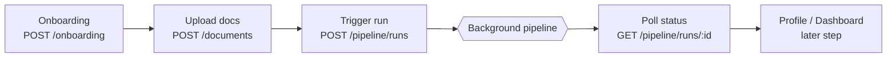
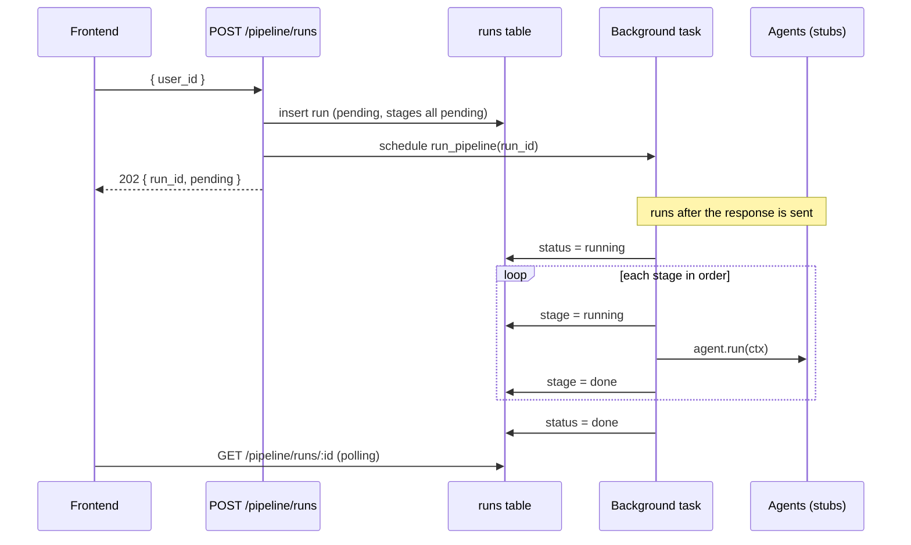

# Pipeline Orchestration

_This document covers the pipeline orchestration layer — the "assembly line" that
runs a user's financial documents through a sequence of agents and reports
progress. It's the step we built **after** document upload and **before** the
real agents._

---

## 1. What this step is, in plain terms

After a user uploads their documents, we need to process them through four steps:

```
parse  →  categorize  →  analyze  →  recommend
```

This step builds the **machinery that runs those four steps in order and tracks
progress** — but *not* the steps themselves yet. Think of it as an assembly line:

- The **conveyor belt and control board** (orchestrator + status tracking) are built.
- Each **station** (agent) exists but is currently **empty** (a no-op stub).

So today a run flows through all four stations instantly and reports "done." When
we fill in each agent later, the same machinery starts doing real work — nothing
about the wiring changes.

### Why build it this way?
We get a **clickable end-to-end flow early**: onboard → upload → trigger a run →
watch the status board light up. The frontend team can build the "processing…"
screen now, against real endpoints, before any agent is smart.

---

## 2. Where it fits in the app



1. User onboards → gets a `user_id`.
2. User uploads documents (tied to that `user_id`).
3. Frontend calls **`POST /pipeline/runs`** → gets a `run_id` back immediately.
4. The pipeline runs **in the background** (the request doesn't block).
5. Frontend **polls `GET /pipeline/runs/{run_id}`** every ~1s to show which agent
   is currently running.
6. When `status` is `done`, the frontend moves the user to the profile/dashboard.

---

## 3. Core concepts

### Run
A **run** is one execution of the pipeline for a user. It has a unique `run_id`,
an overall `status`, and a list of per-stage statuses. Every run is stored as a
row in the `runs` table so it survives across requests (the upload request and
the background worker are different execution contexts — they can only share
state through the database).

### Stage
The four fixed steps: `parse`, `categorize`, `analyze`, `recommend`. Defined once
in [`app/pipeline/stages.py`](../app/pipeline/stages.py) as the `Stage` enum plus
`STAGE_ORDER` (the order the orchestrator runs them in).

### Statuses
- **`RunStatus`** (whole run): `pending → running → done` (or `failed`).
- **`StageStatus`** (each stage): `pending → running → done` (or `failed`).

### The agent contract — `BaseAgent`
Every agent implements the same contract in
[`app/agents/base.py`](../app/agents/base.py):

```python
class BaseAgent(ABC):
    stage: Stage                       # which stage this agent fulfills

    @abstractmethod
    def run(self, ctx: AgentContext) -> None:
        """Read this stage's input for ctx.run_id, do the work, write output back."""
```

`AgentContext` is a small object carrying `run_id` and `user_id`. **Agents never
call each other.** Each one reads its input from the database (by `run_id`), does
its work, and writes its output back to the database. This is what lets the
orchestrator sequence them linearly with no shared in-memory state.

### The orchestrator
[`app/pipeline/orchestrator.py`](../app/pipeline/orchestrator.py) is a **linear
sequencer** (not a graph engine). `run_pipeline(run_id)`:

1. Marks the run `running`.
2. For each agent in order: mark stage `running` → call `agent.run(ctx)` →
   mark stage `done`.
3. If any agent raises, mark that stage + the whole run `failed` and stop.
4. If all pass, mark the run `done`.

---

## 4. New API endpoints

Both live under [`app/api/routes/pipeline.py`](../app/api/routes/pipeline.py) with
the prefix `/pipeline`.

### `POST /pipeline/runs` — trigger a run

Creates a run and starts the pipeline **in the background**. Returns immediately.

**Request body**
```json
{ "user_id": "fd87f41c-7a51-4a54-aa29-562d433449a3" }
```

**Response — `202 Accepted`** (the run, freshly created, everything pending)
```json
{
  "id": "9351c790-376f-4f7c-9592-20dbe22f8407",
  "user_id": "fd87f41c-7a51-4a54-aa29-562d433449a3",
  "status": "pending",
  "current_stage": null,
  "stages": [
    { "stage": "parse",      "status": "pending", "error": null },
    { "stage": "categorize", "status": "pending", "error": null },
    { "stage": "analyze",    "status": "pending", "error": null },
    { "stage": "recommend",  "status": "pending", "error": null }
  ],
  "error": null,
  "created_at": "2026-07-16T09:00:00Z",
  "updated_at": "2026-07-16T09:00:00Z"
}
```

**Errors**
- `404 Not Found` — `user_id` doesn't exist.

> **Why 202 and not 200?** `202 Accepted` means "request accepted, work is
> happening asynchronously." That's exactly our case: the run is created and
> queued, but processing isn't finished when we respond.

### `GET /pipeline/runs/{run_id}` — poll status

Returns the current state of a run. The frontend calls this on a timer.

**Response — `200 OK`** (mid-run example)
```json
{
  "id": "9351c790-376f-4f7c-9592-20dbe22f8407",
  "user_id": "fd87f41c-7a51-4a54-aa29-562d433449a3",
  "status": "running",
  "current_stage": "categorize",
  "stages": [
    { "stage": "parse",      "status": "done",    "error": null },
    { "stage": "categorize", "status": "running", "error": null },
    { "stage": "analyze",    "status": "pending", "error": null },
    { "stage": "recommend",  "status": "pending", "error": null }
  ],
  "error": null,
  "created_at": "2026-07-16T09:00:00Z",
  "updated_at": "2026-07-16T09:00:03Z"
}
```

**Errors**
- `404 Not Found` — `run_id` doesn't exist.

**How the frontend uses it:** render the `stages` array as a checklist and stop
polling once `status` is `done` or `failed`.

---

## 5. Data model

### `runs` table (in [`db/schema.sql`](../db/schema.sql))

| Column          | Type          | Notes                                             |
|-----------------|---------------|---------------------------------------------------|
| `id`            | `uuid` PK     | The `run_id`. Auto-generated.                     |
| `user_id`       | `uuid` FK     | References `users(id)`, cascade delete.           |
| `status`        | `text`        | `pending` / `running` / `done` / `failed`.        |
| `current_stage` | `text`        | The stage in progress (null when done/idle).      |
| `stages`        | `jsonb`       | Array of `{ stage, status, error }` — the progress board. |
| `error`         | `text`        | Set when the run fails.                           |
| `created_at`    | `timestamptz` | Defaults to `now()`.                              |
| `updated_at`    | `timestamptz` | Bumped on every status change.                    |

> **Why `stages` as `jsonb` instead of a separate `run_stages` table?** For four
> fixed stages, a single JSON column is simpler to read and write, and the poll
> endpoint returns it as-is with no joins. If stages ever became dynamic or
> needed per-stage querying, a child table would be the move.

### `Run` schema (in [`app/models/pipeline.py`](../app/models/pipeline.py))
Pydantic models mirroring the table: `Run`, `StageState`, plus the `RunStatus`,
`StageStatus` enums and `RunRequest` (the POST body). `initial_stages()` builds
the default all-pending stage list for a new run.

---

## 6. How background execution works



We use **FastAPI `BackgroundTasks`**: `background.add_task(run_pipeline, run_id)`.
The task runs *after* the HTTP response is sent, so the client isn't blocked.
FastAPI runs synchronous background functions in a threadpool, so blocking work
(like the LLM calls the real agents will make) won't freeze the server's event
loop.

> **Future upgrade path:** `BackgroundTasks` is in-process — if the server
> restarts mid-run, that run is orphaned in `running`. That's fine for an MVP.
> For production you'd move to a real task queue (e.g. Celery/RQ/Arq) or a
> Supabase edge function; the run-status contract stays identical, so the
> frontend wouldn't change.

---

## 7. File-by-file reference

| File | What it holds |
|------|---------------|
| [`app/pipeline/stages.py`](../app/pipeline/stages.py) | `Stage` enum + `STAGE_ORDER`. |
| [`app/models/pipeline.py`](../app/models/pipeline.py) | `Run`, `StageState`, `RunStatus`, `StageStatus`, `RunRequest`, `initial_stages()`. |
| [`app/agents/base.py`](../app/agents/base.py) | `BaseAgent` ABC + `AgentContext`. The shared contract. |
| [`app/agents/parser_agent.py`](../app/agents/parser_agent.py) | `ParserAgent` stub (stage = parse). |
| [`app/agents/categorizer_agent.py`](../app/agents/categorizer_agent.py) | `CategorizerAgent` stub (stage = categorize). |
| [`app/agents/analysis_agent.py`](../app/agents/analysis_agent.py) | `AnalysisAgent` stub (stage = analyze). |
| [`app/agents/recommendation_agent.py`](../app/agents/recommendation_agent.py) | `RecommendationAgent` stub (stage = recommend). |
| [`app/services/pipeline_service.py`](../app/services/pipeline_service.py) | `runs` table CRUD + status helpers. All DB access lives here. |
| [`app/pipeline/orchestrator.py`](../app/pipeline/orchestrator.py) | `run_pipeline(run_id)` — the linear sequencer. |
| [`app/api/routes/pipeline.py`](../app/api/routes/pipeline.py) | The two endpoints above. |
| [`db/schema.sql`](../db/schema.sql) | `runs` table DDL. |

---

## 8. How to plug in a real agent (later)

When we implement an agent for real, we only touch its own file — the
orchestrator, routes, and status tracking stay untouched. Example (parser):

```python
class ParserAgent(BaseAgent):
    stage = Stage.parse

    def run(self, ctx: AgentContext) -> None:
        # 1. read this run's documents        (input, by ctx.run_id / ctx.user_id)
        # 2. extract text (pdf/csv/excel)
        # 3. mask PII via core.security        <-- before any LLM call
        # 4. LLM-parse into normalized records
        # 5. write transactions tagged run_id  (output, back to the DB)
```

Because agents talk only through the DB keyed by `run_id`, the categorizer will
later read exactly what the parser wrote, and so on down the line.

---

## 9. Current limitations (by design)

- **Agents are no-op stubs** — a run completes instantly and produces no data yet.
- **`transactions` and downstream tables aren't created yet** — they return with
  the real parser (each transaction will carry a `run_id` so re-runs stay clean).
- **PII masking** ([`app/core/security.py`](../app/core/security.py)) is still an
  empty stub — it gets implemented at the parser step, before the first LLM call.
- **In-process background tasks** — see the upgrade note in §6.

---

## 10. How to test it now

```bash
# 1. Create the runs table: run db/schema.sql in the Supabase SQL editor.

# 2. Start the server
uvicorn app.main:app --reload

# 3. Open the interactive docs
#    http://127.0.0.1:8000/docs

# 4. Trigger a run (use a user_id that exists from onboarding)
#    POST /pipeline/runs   { "user_id": "<existing-user-id>" }

# 5. Poll it
#    GET /pipeline/runs/{run_id}
#    -> status goes pending -> running -> done, stages flip to done in order
```

Since the agents are stubs, the run will reach `done` almost immediately — that's
expected. The point is that the **machinery, status tracking, and API contract
are real and working**.
